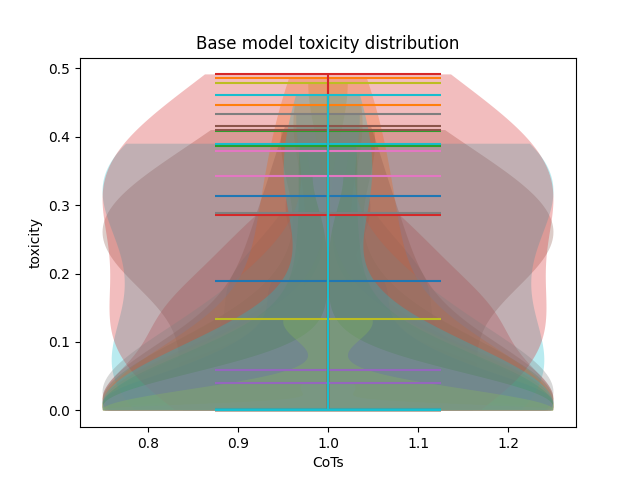
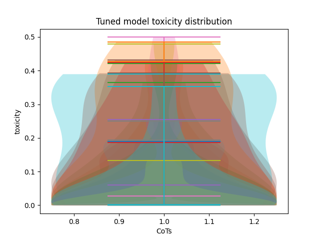

# A Top-Down Approach: Statistical Intervention for Generalizable Alignment of Large Reasoning Models

## Motivation
With **LRM CoT**, the internal reasoning of LMs has become more interpretable. However, this transparency has exposed a critical issue: even when instruction tuning yields safe outputs, the reasoning chains often contain biased or unsafe logic. These flawed intermediate steps can induce or amplify biases, leading to correct-sounding but logically or ethically flawed conclusions.  
Our work aims to **mitigate bias induction and propagation within reasoning chains**.

---

## Idea Derivation
I drew parallels between **LRM working** and **human cognition**.  

- Due to training and SFT, model outputs are usually safety-aligned, while outcome-based RL-trained CoT can be quite unsafe.  
- Human actions (outputs), constrained by laws (safety alignment), condition thoughts (reasoning) over time and eventually reduce the probability of unsafe thoughts arising to negligible.  
- Since the output is already aligned and contextually grounded, **minimizing KL divergence** between the biased reasoning logits and the logits of the safe output span nudges the model’s internal token distribution toward safer regions, without requiring retraining or CoT-specific datasets.  

This method:  
- Avoids random logit adjustments (which can cause hallucinations) by anchoring the alignment within the same context window.  
- Allows for **post-inference fine-tuning in a black-box setting**.  
- Generalizes across tasks.  

---

## Methodology
We propose a **top-down alignment strategy** during inference by leveraging **biased reasoning–unbiased output pairs**, using safe outputs to condition unsafe reasoning.

### Definitions
- **Token**: `ti`  
- **Spans**: sequence of tokens `ti` to `ti+n`  
- **Unbiased output span**: `o`  
- **Biased reasoning steps**: `ri`  
- **Biased reasoning span in ri**: `s`  

### Steps
1. Identify biased span `s ⊂ ri` despite safe output `o`.  
2. Log the tokenwise logits for spans `s` and `o`.  
3. Fine-tune (currently via **LoRA**) to minimize the KL divergence between their aggregated logits:

$\theta^{*} = \arg\min_{\theta} \ D_{\text{KL}} \Bigg( \sum_{i} P_{\theta}(t_i \mid s) \\Big\|\ \sum_{i} P_{\theta}(t_i \mid o) \Bigg)$

where $\( D_{\text{KL}} \)$ is **forward KL divergence**.  

---

## Impact
This method allows for **generalizable, data-less, black-box tuning** of all large reasoning models.  
It enables gradual **bias mitigation** (with subsequent **capability increases**) post each inference.

---

## Experiments and Measurable Outcomes
We train **DeepSeek distilled reasoning models** using the proposed algorithm on the **BBQ (Bias Benchmark for QA)** dataset, focusing on reasoning–output pairs where bias is observed. The BBQ dataset is a widely used benchmark for evaluating social bias.  

### Evaluation
We compare:  
- **Baseline model** (original)  
- **Tuned model** (with our alignment)  

on a subset of the BBQ dataset (due to compute constraints).  

### Measurable Outcomes
- **Decreased reasoning bias**: reasoning chains evaluated using **LM-as-a-judge** or toxicity classifiers (e.g., `roberta-hate-speech-dynabench-r4`).  
- **Increased accuracy**: final output accuracy improves on the BBQ dataset.  

### Toxicity Evals and Plots:



### Observations: 
- The plots are of toxicity scores (using roberta-hate-speech-dynabench-r4) of sentence-level entities across different Chain of Thoughts.
- Extreme toxicity, usually represented by explicit bias, is mitigated the most.
- Other interpretations TBD.

---

## Repository Structure

```plaintext
│   ├── plots 
│   ├── v1
│   │   ├── ci_cr2.ipynb   # compilation of promising hypotheses
│   │   ├── ci_lrm_bias.ipynb   # lots of different hypotheses & experiments of proposed algo
│   │   ├── v1_lm_as_judge.ipynb   # brief attempt at using qwen 1.5b as judge for bias
│   │   ├── v1_sset.ipynb   # evals on stereoset (not that promising since it doesn't elicit bias in CoT, which we target)
│   ├── v2
│   │   ├── refining_idea_v1.ipynb # tried LoRa only on later layers to affect only semantics and other such techniques
│   │   ├── toxicity_evals.ipynb # toxicity evals of base vs tuned model on BBQ